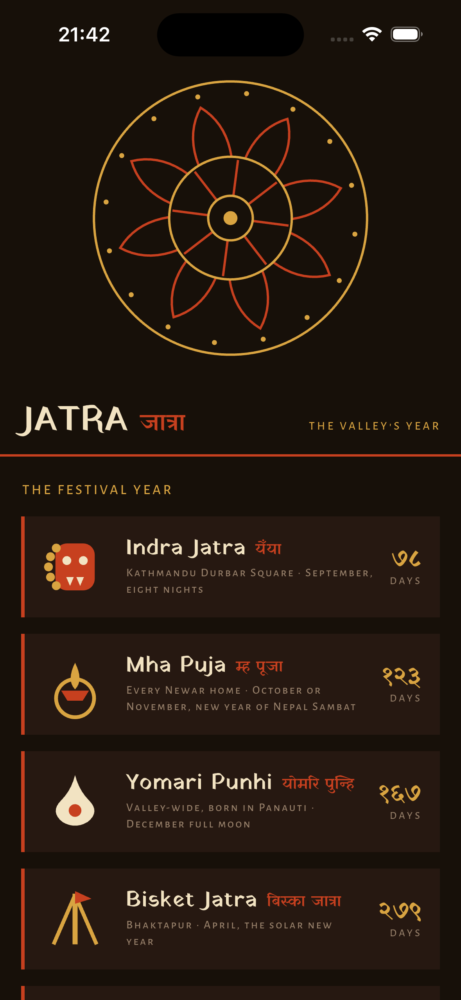
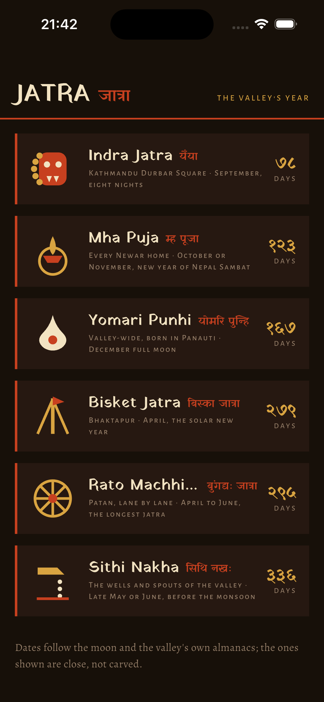
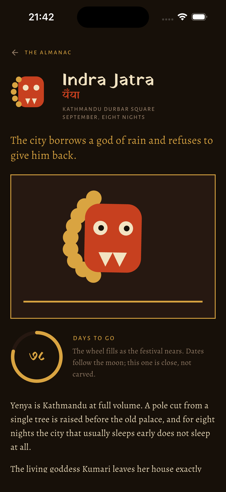
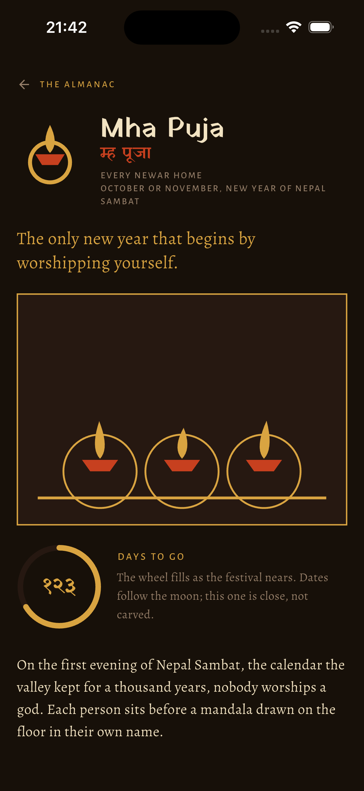
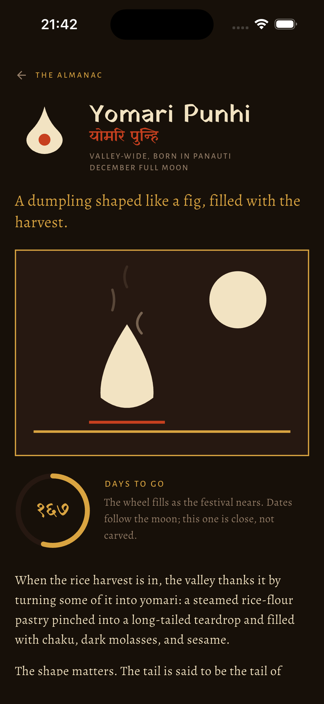
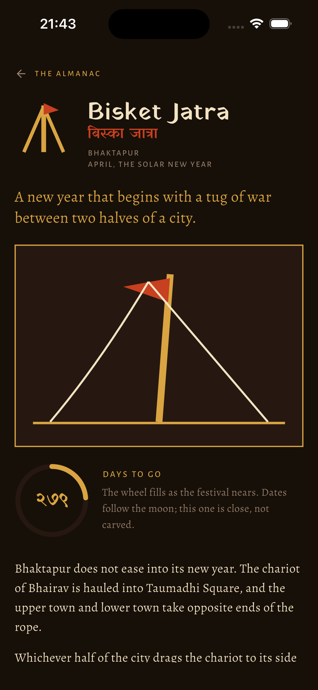
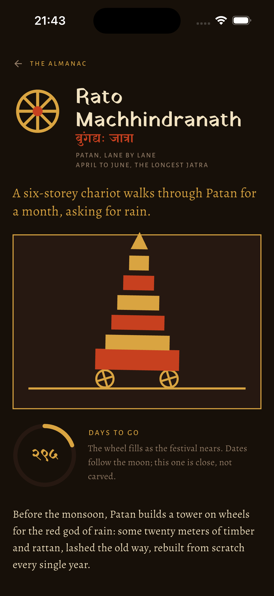
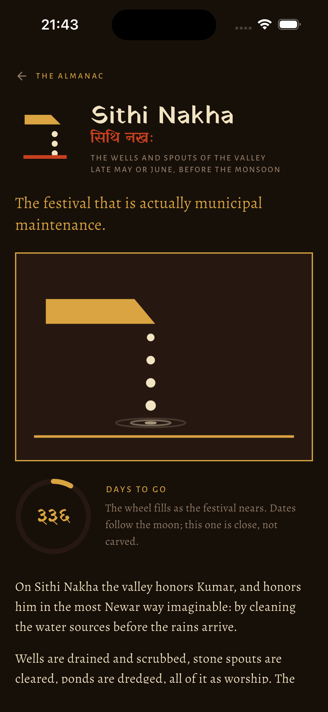

# Jatra (जात्रा)

A living almanac of the great Newar festivals of the Kathmandu
Valley: Indra Jatra, Mha Puja, Yomari Punhi, Bisket Jatra, Rato
Machhindranath, and Sithi Nakha. Each one gets its story, its
rituals, a countdown, and a hand-painted scene that never stops
breathing.

Everything that moves in this app is drawn with CustomPainter and
driven by an AnimationController. There is no animation package, no
Lottie, no Rive. That is the point of the repo.

## What to look at

- **The mandala** (`lib/painters/mandala.dart`, driven in
  `lib/screens/home.dart`): an eightfold mandala in a pinned
  SliverPersistentHeader. It idles at one turn per ninety seconds,
  tracks a finger by atan2 deltas with wraparound normalization, and
  when flung it coasts on a real `FrictionSimulation`, with angular
  velocity derived from the tangential component of the gesture
  velocity. Drag it. Fling it. That is the interview demo.
- **The scenes** (`lib/painters/scenes.dart`): every festival has a
  flat-color scene that loops on a single phase, so nothing jumps at
  the wrap. The Machhindranath chariot sways as its wheels roll, the
  Bisket pole rocks between a taut rope and a slack one, the Lakhey
  bobs with a mane that shivers petal by petal, three Mha Puja
  flames each keep their own time, steam rises off a yomari under a
  December moon, and a hiti spout beads water into widening ripples.
- **The choreography**: staggered Interval curves for card and
  section entrances, Hero glyphs across a custom PageRouteBuilder
  transition, a countdown arc animated with TweenAnimationBuilder,
  and RepaintBoundary around every looping painter so the text
  layers never pay for the animation.

## The design

The palette is a jatra at dusk: soot, sindoor vermilion, marigold,
rice-flour cream. Flat color only, no gradients. Yatra One carries
the display type in Latin and Devanagari alike; countdowns are set
in Devanagari numerals.

Festival dates follow the lunar calendars of the valley, so the
Gregorian dates in `lib/data/festivals.dart` are close approximations
for the coming cycle, clearly labeled as such in the app.

## Run it

```sh
flutter pub get
flutter run       # a device with 120Hz does it justice
flutter test      # almanac, navigation, and calendar arithmetic
```

## Preview
<div align="center">
  
  
  
</div>
<br/>
<div align="center">
  
  
  
</div>
<br/>
<div align="center">
  
  
</div>
